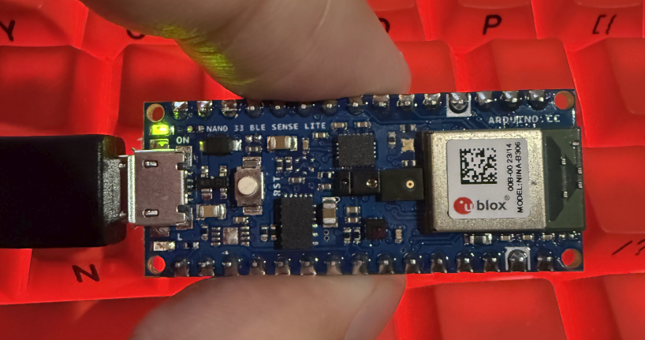
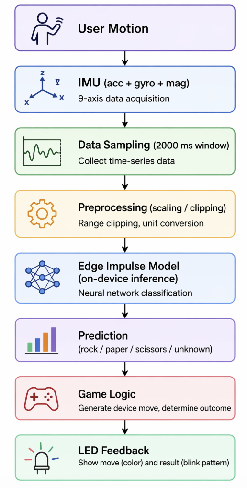
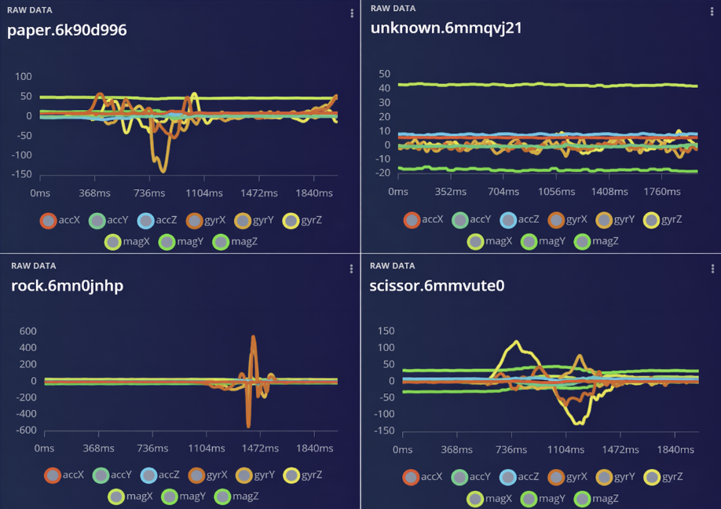
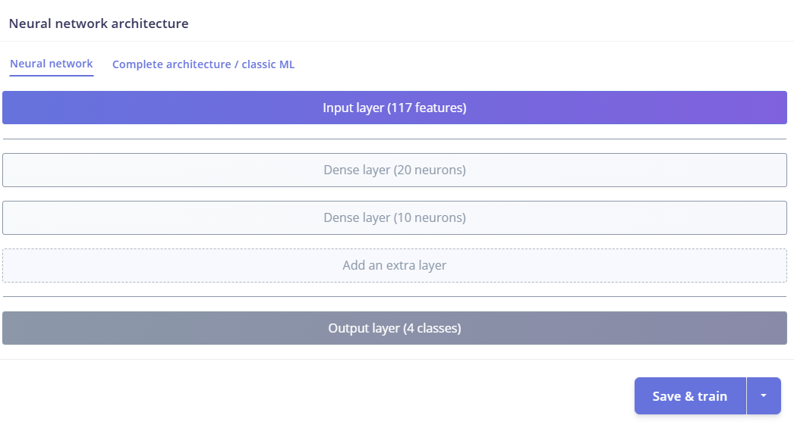
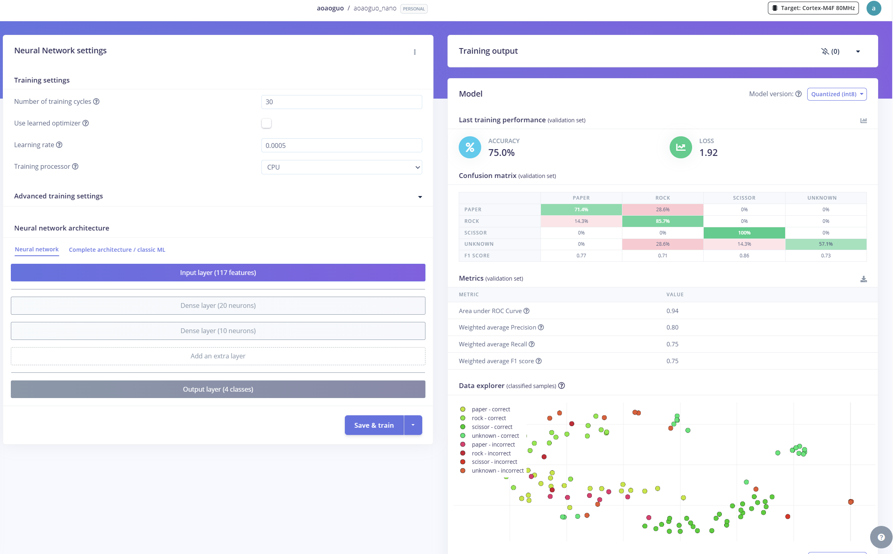

# An Embedded Rock-Paper-Scissors Game Using Real-Time IMU Gesture Recognition
Name: Aoao Guo  

GitHub Repository:  
https://github.com/aoaoguo2003/casa0018  

Edge Impulse Project:  
https://studio.edgeimpulse.com/public/926176/live
## Introduction

This project presents a real-time gesture recognition system implemented on the Arduino Nano 33 BLE Sense. Using a 9-axis inertial measurement unit (IMU), the system captures motion data and classifies user hand gestures into rock, paper, and scissors. The model is deployed directly on the device using Edge Impulse, enabling on-device inference without reliance on external computation. The system is further extended into an interactive game, where the device responds with its own randomly generated move and communicates the outcome through an RGB LED interface.

The inspiration for this project comes from the growing field of edge artificial intelligence, where machine learning models are deployed on resource-constrained devices to enable interaction (Lane et al., 2015). Gesture recognition is a common application in this domain, and this project explores how such systems perform under real-world conditions, including variations in device orientation and non-standard movements.

The design is loosely based on existing IMU-based gesture recognition systems, but extends them by integrating robustness considerations and a complete interaction loop, from sensing to decision-making and feedback. This makes the project a compact example of an end-to-end embedded machine learning application.

*Figure 1: Overview of the embedded gesture recognition system pipeline, showing the flow from IMU sensing to on-device inference and LED-based feedback.*
## Research Question
How can a real-time IMU-based gesture recognition system be reliably deployed on Arduino Nano 33 BLE Sense to enable rock-paper-scissors game under real-world conditions?

## Application Overview
The system follows a modular embedded machine learning pipeline that connects sensing, inference, and interaction components. Motion data is captured by the onboard IMU of the Arduino Nano 33 BLE Sense and passed through a preprocessing stage to match the conditions used during model training.

The processed data is then fed into a lightweight neural network model generated using Edge Impulse and deployed on-device using the EON compiler. The model performs real-time classification, predicting one of four gesture classes.

The prediction is integrated into a simple game logic module, where the device generates a random move and compares it with the user’s gesture to determine the outcome. The result is communicated through the built-in RGB LED, providing immediate feedback to the user.

*Figure 2: System architecture of the embedded gesture recognition application. The pipeline shows how IMU data are collected, processed, classified using an on-device machine learning model, and translated into interactive LED feedback through game logic.*

## Data
The dataset for this project was collected manually using the onboard 9-axis IMU (accelerometer, gyroscope, and magnetometer) of the Arduino Nano 33 BLE Sense. Each sample consists of multivariate time-series data captured over a 2000 ms window at a fixed sampling rate, forming sequences of motion signals across nine axes. The dataset includes four classes: rock, paper, scissors, and unknown.

Initial data collection focused on recording standard gestures under a fixed device orientation. However, early testing revealed that the model was highly sensitive to orientation changes, leading to poor real-world performance. To address this, additional data were collected for the rock and paper classes under varied orientations (e.g., slight rotations and tilts), improving the model’s robustness to positional variation. An “unknown” class was also introduced to capture non-standard inputs, including static states, random movements, and incomplete gestures. This helped reduce false positives by allowing the model to reject ambiguous inputs instead of forcing a classification into one of the valid gesture classes.

*Figure 3: Representative examples of raw IMU time-series data for the four gesture classes: paper, rock, scissors, and unknown. Each plot shows multi-axis sensor signals (accelerometer, gyroscope, and magnetometer) over a 2000 ms sampling window. Distinct temporal patterns can be observed for each gesture, while the unknown class exhibits relatively stable or irregular signals.*
## Model

The model was developed using the Edge Impulse platform, which provides an integrated workflow for building and deploying embedded machine learning systems. A lightweight neural network classifier was used to perform gesture recognition.

The architecture consists of a small fully connected network with two dense layers, designed to balance classification performance with the limited computational resources of the Arduino Nano 33 BLE Sense. Rather than increasing model complexity, the design prioritises efficiency, enabling real-time inference with low latency and minimal memory usage.

During development, alternative approaches such as increasing network size or adding additional layers were considered. However, these were not pursued due to diminishing returns in performance and the constraints of embedded deployment. Instead, improvements in model performance were primarily achieved through iterative refinement of the dataset and class design.

The model was deployed using the Edge Impulse EON compiler, which optimises execution for embedded hardware by reducing memory footprint and inference time. This ensured that the system could run entirely on-device without external computation.

*Figure 4: Neural network architecture used in this project. The model consists of an input layer with 117 extracted features, followed by two fully connected layers with 20 and 10 neurons respectively, and a final output layer for four-class classification (rock, paper, scissors, unknown).*
## Experiments

A series of four iterative experiments were conducted to evaluate the performance and robustness of the gesture recognition system. Each version introduced a controlled modification to the dataset, allowing for a systematic comparison between validation accuracy in Edge Impulse and real-world performance on the Arduino Nano.

The first version was trained using a small and highly standardised dataset containing only three gesture classes: rock, paper, and scissors. Both the training and testing data were collected under consistent device orientation and clean conditions. This resulted in a very high validation accuracy of 98.33% in Edge Impulse. However, when deployed on the Nano, the real-world accuracy dropped to below 30%, indicating that the model had overfitted to the controlled dataset and lacked generalisation capability. As shown in Figure 5, the model achieves very high validation accuracy under controlled conditions.

In the second version, an additional “unknown” class was introduced to represent non-standard inputs, including static states and random movements. A corresponding validation set was also added. This increased the complexity of the classification task and reduced the validation accuracy to 67%. Despite this, real-world performance improved to approximately 50%, as the model became more capable of rejecting ambiguous or irrelevant inputs instead of forcing incorrect predictions. This effect is illustrated in Figure 6, where the introduction of the unknown class reduces accuracy but improves robustness.

The third version focused on improving robustness to device orientation. Additional training data was collected under varied hand positions and angles while maintaining the same gesture labels. This addressed the sensitivity of IMU-based features to spatial orientation. As a result, validation accuracy increased to 75%, and real-world accuracy improved further to around 60%, demonstrating better generalisation across different usage conditions. Figure 7 demonstrates the improvement in model performance after introducing orientation variation.

In the final version, the dataset was expanded by increasing the number of samples across all gesture classes, with particular emphasis on classes that previously showed confusion, such as rock and paper. This resulted in a validation accuracy of 87.5%, while on-device accuracy improved to approximately 70%, representing the most stable performance achieved in this project. The final model performance is shown in Figure 8, highlighting improved accuracy and stability.

To complement validation metrics provided by Edge Impulse, real-world testing was conducted directly on the Nano through serial output during live interaction. This combined evaluation approach highlighted a key limitation of relying solely on validation accuracy, as early models with high validation scores performed poorly in real-world scenarios.

*Figure 5: Performance of Version 1, trained on a small and highly standardised dataset with only three gesture classes. Although the validation accuracy reaches 98.33%, the model lacks generalisation and performs poorly in real-world testing.*

*Figure 6: Performance of Version 2 after introducing an additional "unknown" class. The validation accuracy decreases to 67% due to increased task complexity, but the model becomes more robust by reducing incorrect forced classifications.*

*Figure 7: Performance of Version 3 after incorporating data collected under varying device orientations. This improves generalisation, increasing validation accuracy to 75% and enhancing real-world robustness.*

*Figure 8: Final model performance (Version 4) after expanding the dataset across all gesture classes. The validation accuracy increases to 87.5%, with significantly improved stability and real-world performance.*

## Results and Observations

The results of this project demonstrate that achieving high validation accuracy in a controlled environment does not necessarily translate to reliable real-world performance. The initial model (Version 1) achieved an accuracy of 98.33% in Edge Impulse, yet performed poorly on the Arduino Nano, with accuracy below 30%. This highlights a clear case of overfitting, where the model learned patterns specific to a highly standardised dataset rather than generalisable features (Goodfellow et al., 2016).

A key observation from subsequent experiments is that data diversity has a greater impact on performance than model complexity. The introduction of an "unknown" class in Version 2 significantly improved robustness by reducing false positives, even though validation accuracy decreased. This demonstrates that a lower accuracy score can still correspond to a more useful and realistic model.

Further improvements were achieved by incorporating variation in device orientation. Since IMU data is highly sensitive to spatial configuration, the inclusion of multi-angle training data in Version 3 improved generalisation and increased real-world accuracy. This indicates that the model was previously learning orientation-dependent patterns rather than gesture-specific motion characteristics.

The final version showed that increasing dataset size and diversity leads to the most stable performance. As summarised in Table 1, model performance improved progressively as the dataset became more diverse and representative of real-world conditions. By expanding the dataset across all gesture classes, the model achieved both higher validation accuracy (87.5%) and improved on-device accuracy (~70%). However, performance is still not perfect, suggesting limitations in the sensing modality and the simplicity of the model.

Overall, the project highlights the importance of data-centric design in embedded machine learning systems. If more time were available, future improvements could include collecting multi-user data under varied orientations and motion speeds, developing orientation-invariant features from IMU signals, and evaluating temporal models such as CNNs or LSTMs to better capture gesture dynamics.

| Version | Key Modification | Validation Accuracy (Edge Impulse) | On-device Accuracy (Arduino Nano) | Main Observation |
|--------|----------------|------------------------------------|----------------------------------|------------------|
| V1 | Baseline (3 classes, standardised data) | 98.33% | <30% | Severe overfitting; poor real-world performance |
| V2 | + Unknown class | 67% | ~50% | Reduced false positives; improved robustness |
| V3 | + Orientation variation | 75% | ~60% | Better generalisation across device positions |
| V4 | + Larger and more diverse dataset | 87.5% | ~70% | Most stable and reliable performance |

*Table 1: Comparison of model performance across four experimental iterations, highlighting the impact of dataset design on both validation and real-world accuracy.*

## Bibliography
1. Lane, N.D., Bhattacharya, S., Georgiev, P., Forlivesi, C., Kawsar, F. (2015). DeepX: A Software Accelerator for Low-Power Deep Learning Inference on Mobile Devices. In Proceedings of the 14th International Conference on Information Processing in Sensor Networks (IPSN). http://doi.org/10.1145/2737095.2737101

2. Goodfellow, I., Bengio, Y., Courville, A. (2016). Deep Learning. Cambridge, MA: MIT Press. http://www.deeplearningbook.org
----

## Declaration of Authorship

I, aoao guo, confirm that the work presented in this assessment is my own. Where information has been derived from other sources, I confirm that this has been indicated in the work.

ASSESSMENT DATE April 22 2026

Word count: 1423
